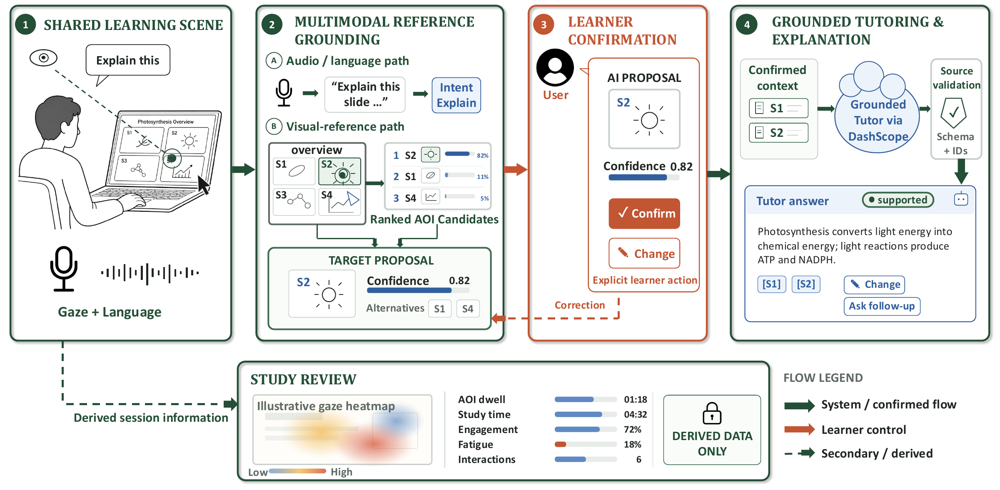

<p align="center">
  
</p>

<h1 align="center">AttentiveSlides</h1>

<p align="center">
  A human-centered AI learning assistant that turns slide references, learner
  intent, and explicit confirmation into source-grounded tutoring.
</p>

<p align="center">
  <a href="#what-is-attentiveslides">About</a> ·
  <a href="#quick-start-manual-mode">Quick Start</a> ·
  <a href="#full-setup-live-mode">Live Setup</a> ·
  <a href="#architecture">Architecture</a> ·
  <a href="SYSTEM_FEATURES.md">System Features</a>
</p>

<!-- TODO(readme-assets): Add .github/assets/hero-workspace.png using docs/README_ASSET_CHECKLIST.md. -->

## What is AttentiveSlides?

AttentiveSlides is a feature-complete prototype for studying presentation
slides with an AI tutor. A learner can upload a PDF, indicate what they mean by
typing, speaking, selecting a region, or looking toward part of a slide, and
then confirm or correct the proposed target before the tutor answers.

The central design rule is simple: **gaze proposes; the learner confirms**.
AttentiveSlides treats gaze and learner-state estimates as uncertain interface
signals, not as ground truth about attention, emotion, cognition, or
comprehension.

The main application is [`apps/streamlit_attentive_slides.py`](apps/streamlit_attentive_slides.py),
served through the supported one-port launcher
[`scripts/run_live_single_port.py`](scripts/run_live_single_port.py).

## How it works

```text
PDF
  → slide rendering, text extraction, and AOI understanding
  → typed or spoken learning intent
  → manual or gaze-based target proposal
  → learner confirmation or correction
  → source-grounded tutor answer
  → reliability and explainability
  → optional Study Review
```

1. **Understand the slide.** Native PDF text and layout produce deterministic
   areas of interest (AOIs), with optional OCR and LLM-assisted visual AOIs.
2. **Capture intent.** The learner types a question, chooses a quick action, or
   speaks through push-to-talk or continuous speech.
3. **Propose a target.** A manual region, explicit AOI, whole slide, coarse gaze
   grid, or local EyeTheia point gaze provides target evidence.
4. **Keep the learner in control.** Confidence and alternatives are visible;
   explicit language can override weak gaze, and ambiguous targets can be
   corrected before generation.
5. **Ground the answer.** Only confirmed slide context enters the Main Tutor.
   Responses are parsed and checked against source IDs before display.
6. **Expose reliability.** The interface explains target and intent evidence,
   source support, reliability state, and available corrective action.
7. **Review the session.** A completed Study can show derived heatmaps, dwell
   totals, study time, and uncertain learner-state aggregates.



*Gaze and language propose a target; the learner confirms or corrects it before
the grounded tutor answers. Study Review uses derived session information only.*

<!-- TODO(readme-assets): Add .github/assets/demo-grounding.gif using docs/README_ASSET_CHECKLIST.md. -->

## Key features

### Study slides without special hardware

- Upload a PDF, render pages lazily, navigate the deck, and keep slide geometry
  aligned with AOIs and selections.
- Extract native PDF text with PyMuPDF and optionally fall back to EasyOCR.
- Ask about a selected region, a known AOI, or the whole slide.
- Use typed questions and quick teaching actions without a camera or microphone.

### Resolve references with learner confirmation

- Combine explicit language with manual selection, gaze grid, or point-gaze
  evidence.
- Show candidate targets, confidence, alternatives, and public reasoning.
- Freeze the confirmed target for each turn; later gaze movement cannot silently
  change it.
- Treat a target switch in persistent voice as a new proposal requiring a
  learner decision.

<!-- TODO(readme-assets): Add .github/assets/feature-confirmation.png using docs/README_ASSET_CHECKLIST.md. -->

### Ask a source-grounded tutor

- Build context from the confirmed AOI, slide text, visual context, bounded
  neighboring-slide text, explicit intent, and sanitized conversation history.
- Use an OpenAI-compatible DashScope chat endpoint for generation.
- Validate structured responses and source IDs with one bounded retry.
- Show a retryable error instead of presenting an unsupported fallback answer
  as confidently grounded.

<!-- TODO(readme-assets): Add .github/assets/feature-grounded-tutor.png using docs/README_ASSET_CHECKLIST.md. -->

### Learn by voice

- Transcribe local audio with faster-whisper after bounded buffering and voice
  activity detection.
- Use push-to-talk or continuous speech through the same target-confirmation
  boundary as typed input.
- Maintain an optional DashScope Omni realtime session while page, engine, and
  confirmed target remain stable.
- Optionally synthesize a completed tutor answer with DashScope/Bailian TTS;
  speech failure does not invalidate the text answer.

<!-- TODO(readme-assets): Add .github/assets/feature-live-voice.png using docs/README_ASSET_CHECKLIST.md. -->

### Review derived study patterns

- Start, pause, resume, finish, and revisit Study sessions.
- Render a per-slide gaze heatmap from bounded dwell cells and AOI totals.
- Review time-weighted emotion, engagement, fatigue, reminder, study-time, and
  completed-interaction summaries as non-diagnostic estimates.
- Export review data or explicitly delete stored sessions.

<!-- TODO(readme-assets): Add .github/assets/feature-study-review.png using docs/README_ASSET_CHECKLIST.md. -->

For the complete implementation-backed inventory, see
[`SYSTEM_FEATURES.md`](SYSTEM_FEATURES.md).

## Human-centered by design

- **Confirmation over inference.** Gaze can suggest a region; it cannot silently
  replace the learner's confirmed target.
- **Language over weak gaze.** An explicit phrase such as "the figure on the
  right" can outweigh uncertain visual-reference evidence.
- **Evidence before fluency.** Unsupported or malformed provider output is not
  displayed as a confidently grounded answer.
- **Uncertainty stays visible.** Emotion, engagement, fatigue, and gaze are
  interface estimates with independent unavailable/error states.
- **Correction remains available.** Alternatives, manual targeting, retry, and
  target-switch controls keep the learner in the loop.

AttentiveSlides does not claim research-grade eye tracking, clinical or
psychological diagnosis, or accurate measurement of cognition, attention,
emotion, fatigue, or comprehension.

## Quick Start: Manual Mode

Manual Mode is the shortest way to explore the application. It requires no
camera, microphone, EyeTheia service, or local learner-state model. The
repository currently uses one unified dependency file, so Manual and Live modes
share the same installation even though Manual Mode does not activate the live
services.

### Requirements

- Python 3.10
- A Linux environment compatible with the pinned packages
- Git

The maintained environment is Ubuntu Linux with an NVIDIA RTX 4060 and CUDA
12.1. Other platforms have not been validated.

```bash
git clone https://github.com/Yudegushi/AttentiveSlides.git
cd AttentiveSlides
python3.10 -m venv .venv
source .venv/bin/activate
python -m pip install -r requirements.txt
python scripts/run_live_single_port.py
```

Open <http://127.0.0.1:8501>, upload a PDF or use the built-in deck, keep Live
input disabled, and select a manual region, AOI, or whole-slide target.

Without a cloud API key, PDF preparation, slide navigation, AOI display, typed
intent, manual targeting, confirmation/correction, local session state, and
Study Review remain available. A grounded tutor answer, Omni realtime voice,
and provider TTS require DashScope configuration.

## Full Setup: Live Mode

Live Mode adds browser camera/microphone capture, local STT, gaze-assisted
target proposals, learner-state estimates, and optional realtime voice. Begin
with the Manual Mode installation, then configure the integrations you intend
to use.

### 1. Prepare local model artifacts

Use an external model directory rather than storing weights in the repository:

```bash
attentive_model_root="${XDG_DATA_HOME:-$HOME/.local/share}/attentiveslides/models"

python scripts/prepare_mobilevit_fatigue.py \
  --target "$attentive_model_root/fatigue/mobilevitv2/best_model.pt"

python scripts/prepare_emotieff_learner_state.py \
  --output-dir "$attentive_model_root/learner_state/emotieff"

export ATTENTIVE_FATIGUE_MODEL_PATH="$attentive_model_root/fatigue/mobilevitv2/best_model.pt"
export ATTENTIVE_EMOTIEFF_MODEL_PATH="$attentive_model_root/learner_state/emotieff/enet_b0_8_best_vgaf_features.ts"
export ATTENTIVE_EMOTIEFF_ENGAGEMENT_PATH="$attentive_model_root/learner_state/emotieff/engagement_single_attention.pt"
```

The preparation scripts pin their upstream revisions and validate available
artifact checksums. Model weights and converted files remain outside Git.

### 2. Configure speech-to-text

faster-whisper is installed from [`requirements.txt`](requirements.txt). The
default application configuration uses the `small` model and downloads its
weights to the external Hugging Face cache on first use.

```bash
export ATTENTIVE_WHISPER_MODEL="small"
export ATTENTIVE_WHISPER_DEVICE="auto"
export ATTENTIVE_WHISPER_COMPUTE_TYPE="auto"
```

### 3. Start EyeTheia separately

AttentiveSlides does not vendor EyeTheia or its weights. Install and run it from
the [EyeTheia repository](https://github.com/patherstevenson/EyeTheia). The
current browser component expects:

```text
ws://127.0.0.1:8001/ws/predict_gaze
```

EyeTheia failure does not stop the rest of Live Mode; targeting degrades to the
configured grid/manual path. See [Advanced Remote Deployment](docs/deployment.md)
when the browser and GPU services run on different machines.

### 4. Enable OCR only when needed

Native PDF text is preferred. Set the following only when scanned or
image-based slides need OCR fallback:

```bash
export ATTENTIVE_ENABLE_OCR="1"
```

EasyOCR lazily initializes with English and Simplified Chinese and may download
its model files to the external user cache on first use.

### 5. Launch and grant browser permissions

```bash
python scripts/run_live_single_port.py --host 127.0.0.1 --port 8501
```

Open <http://127.0.0.1:8501>, enable Live input, and grant the browser camera
and microphone permissions. Point gaze additionally requires the EyeTheia
endpoint above.

## Model and service configuration

The four local/live model integrations are:

| Capability | Integration | Repository behavior |
|---|---|---|
| Speech-to-text | [faster-whisper](https://github.com/SYSTRAN/faster-whisper), default model `small` | Downloads weights on first use and transcribes locally |
| Point gaze | [EyeTheia](https://github.com/patherstevenson/EyeTheia) | Runs as a separate loopback WebSocket service |
| Emotion and engagement | [EmotiEffLib](https://github.com/sb-ai-lab/EmotiEffLib) pinned artifacts | Prepared by `prepare_emotieff_learner_state.py` |
| Fatigue estimate | [MobileViT-v2 drowsiness model](https://huggingface.co/mosesb/drowsiness-detection-mobileViT-v2) pinned revision | Prepared by `prepare_mobilevit_fatigue.py` |

DashScope supplies the Grounded Tutor, optional Omni realtime voice, and
optional TTS. EasyOCR is an additional slide-processing fallback rather than a
live learner model.

## API configuration

The application reads process environment variables directly. It does **not**
automatically load a `.env` file.

At minimum, cloud-backed tutoring requires:

```bash
export DASHSCOPE_API_KEY="your-api-key"
```

Never commit a real key. The supported provider variables are:

| Feature | Variables and current defaults |
|---|---|
| Grounded Tutor | `DASHSCOPE_BASE_URL` = `https://dashscope.aliyuncs.com/compatible-mode/v1`; `DASHSCOPE_MODEL` = `qwen3.7-plus`; optional `DASHSCOPE_TEMPERATURE`, `DASHSCOPE_MAX_TOKENS`, `DASHSCOPE_TIMEOUT_SECONDS`, `DASHSCOPE_TRANSPORT_RETRIES` |
| Optional LLM-assisted AOIs | `SLIDE_AOI_LLM_ENDPOINT`, `SLIDE_AOI_LLM_API_KEY`, and `SLIDE_AOI_LLM_MODEL`; a configured `DASHSCOPE_API_KEY` defaults this path to DashScope `qwen-vl-plus` |
| Omni realtime | `DASHSCOPE_WORKSPACE_ID` (optional); `ATTENTIVE_REALTIME_MODEL` = `qwen3.5-omni-plus-realtime`; `ATTENTIVE_REALTIME_REGION` = `beijing`; `ATTENTIVE_REALTIME_VOICE` = `Tina`; optional `ATTENTIVE_REALTIME_BASE_URL`, `ATTENTIVE_REALTIME_VAD_THRESHOLD`, `ATTENTIVE_REALTIME_SILENCE_MS` |
| Text-to-speech | `DASHSCOPE_BASE_HTTP_API_URL` = `https://dashscope.aliyuncs.com/api/v1`; request defaults are model `qwen3-tts-instruct-flash`, voice `Cherry`, language `Chinese` |

The UI also exposes a permission control for whether selected slide text may be
sent to the cloud tutor. Disabling it keeps local study and targeting available
but blocks cloud answer generation.

## Architecture

AttentiveSlides keeps browser capture, inference workers, target resolution,
and tutoring behind explicit contracts and bounded state:

```text
Browser + Streamlit workspace
  ├─ PDF → render/text/OCR → deterministic AOIs → optional validated LLM AOIs
  ├─ text/quick action/audio → intent → target proposal
  ├─ camera → Face Mesh → EyeTheia point gaze ─┐
  └─ manual region / gaze grid ────────────────┴→ confirmation
                                                   ↓
confirmed slide context → Grounded Tutor → source validation → answer + XAI
                                                   ↓
                         sanitized history/logs + derived Study Review
```

The launcher exposes Streamlit, media ingress, voice WebSockets, and slide
previews through one public aiohttp port. Workers publish bounded state instead
of calling Streamlit directly. Runtime files default to
`$XDG_DATA_HOME/attentive_slides` or `~/.local/share/attentive_slides` and can be
overridden with `ATTENTIVE_RUNTIME_DATA_DIR`.

See [`SYSTEM_FEATURES.md`](SYSTEM_FEATURES.md) for module boundaries and primary
implementation paths.

## Privacy and capability boundaries

- Browser video and 16 kHz mono audio use bounded in-memory queues. Temporary
  transcription audio is deleted after use.
- Browser Face Mesh data and frames used for point gaze go to the separately
  configured local EyeTheia service; raw gaze inputs are not stored in Study
  Review.
- Only confirmed slide context and bounded, sanitized conversation history are
  eligible for the cloud tutor when cloud text permission is enabled.
- Public state excludes API keys, raw provider payloads, full prompts, hidden
  reasoning, and unvalidated claims.
- Study Review persists derived heatmap cells, AOI dwell, study time, and
  time-weighted aggregates. It does not persist raw video, audio, face crops,
  raw gaze points, per-frame predictions, or credentials.
- Learner-state outputs are uncertain, non-diagnostic interface signals and do
  not block the core slide, targeting, or tutoring workflow when unavailable.

## Project status

AttentiveSlides is a **feature-complete prototype** under maintenance-focused
development. Current work prioritizes stability fixes, dependency
compatibility, documentation, and reproducible evaluation rather than new
feature expansion.

The automated suite covers interaction contracts, media queues, audio, gaze,
learner state, Study Review persistence, Streamlit layout, grounded tutoring,
XAI, and voice orchestration. The most recent full run on the maintained 4060
environment completed 878 tests successfully. Browser hardware acceptance,
real-provider behavior, concurrent GPU workload behavior, and participant-level
accuracy remain separate physical-environment evaluation tasks.

Maintenance contributions are welcome through
[GitHub Issues](https://github.com/Yudegushi/AttentiveSlides/issues), especially
for reproducible bug reports, compatibility fixes, documentation corrections,
and test-backed stability improvements.

## Acknowledgements

AttentiveSlides builds on external frameworks, services, and model artifacts.
Their upstream licenses and terms remain authoritative:

| Project or service | Role | Upstream license/status |
|---|---|---|
| [Streamlit](https://github.com/streamlit/streamlit) | Application UI | Apache-2.0 |
| [PyMuPDF](https://pymupdf.readthedocs.io/en/latest/about.html#license-and-copyright) | PDF rendering and text extraction | AGPL or commercial license |
| [EasyOCR](https://github.com/JaidedAI/EasyOCR) | Optional OCR fallback | Apache-2.0 |
| [faster-whisper](https://github.com/SYSTRAN/faster-whisper) | Local speech-to-text | MIT |
| [EyeTheia](https://github.com/patherstevenson/EyeTheia) | Local point-gaze service | GPL-3.0 |
| [EmotiEffLib](https://github.com/sb-ai-lab/EmotiEffLib) | Emotion and engagement artifacts | Apache-2.0 |
| [MobileViT-v2 drowsiness model](https://huggingface.co/mosesb/drowsiness-detection-mobileViT-v2) | Fatigue estimate artifact | MIT model card |
| [Alibaba Cloud Model Studio / DashScope](https://www.alibabacloud.com/help/en/model-studio/) | Grounded Tutor, Omni realtime, and TTS provider | Cloud service terms apply |

Vendored Literata and IBM Plex Sans files retain their SIL Open Font License
1.1 texts under [`assets/fonts/`](assets/fonts/README.md).

## License

Original AttentiveSlides source code and documentation are licensed under the
[GNU Affero General Public License version 3 only](LICENSE)
(`AGPL-3.0-only`). See [NOTICE](NOTICE) for the project copyright scope and
third-party component, model, font, service, and data boundaries.
